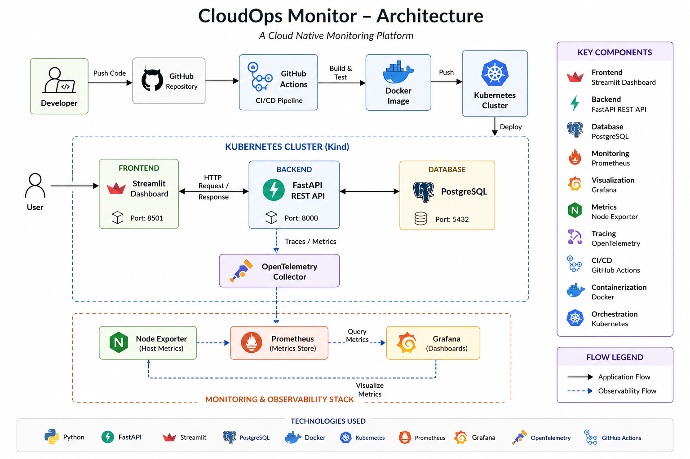
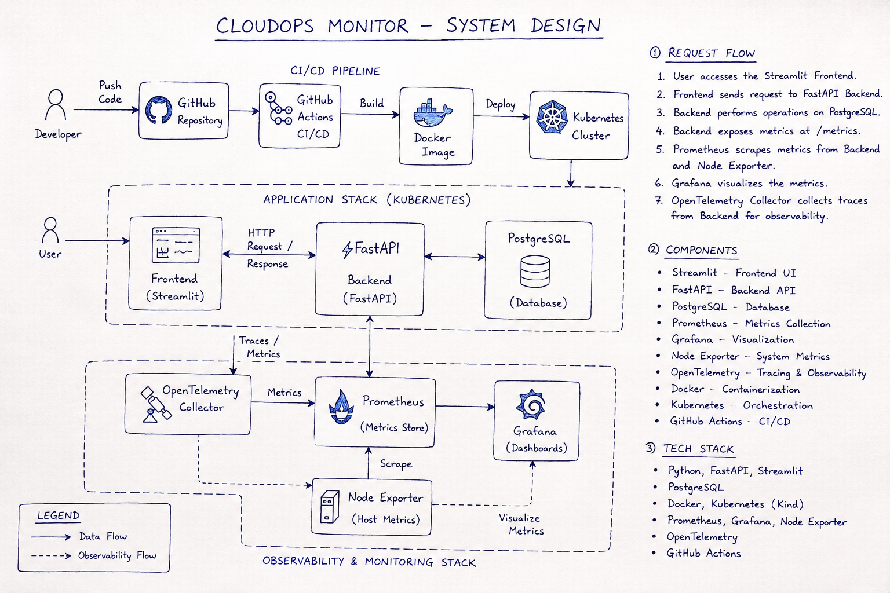
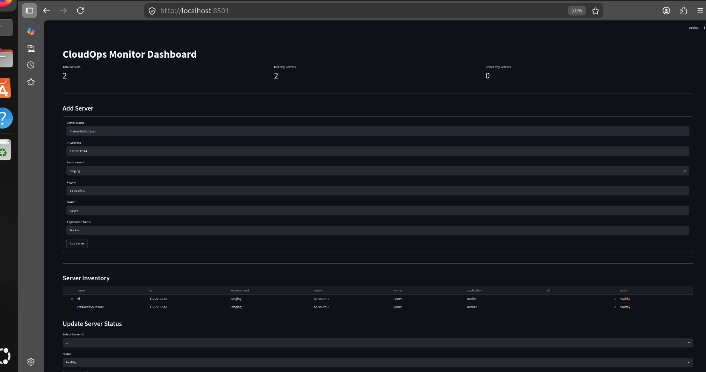
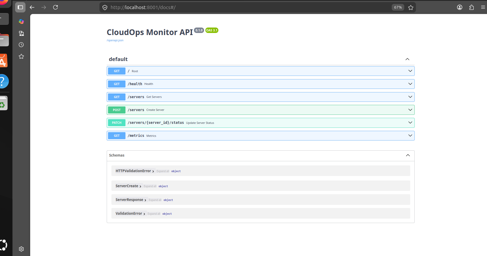
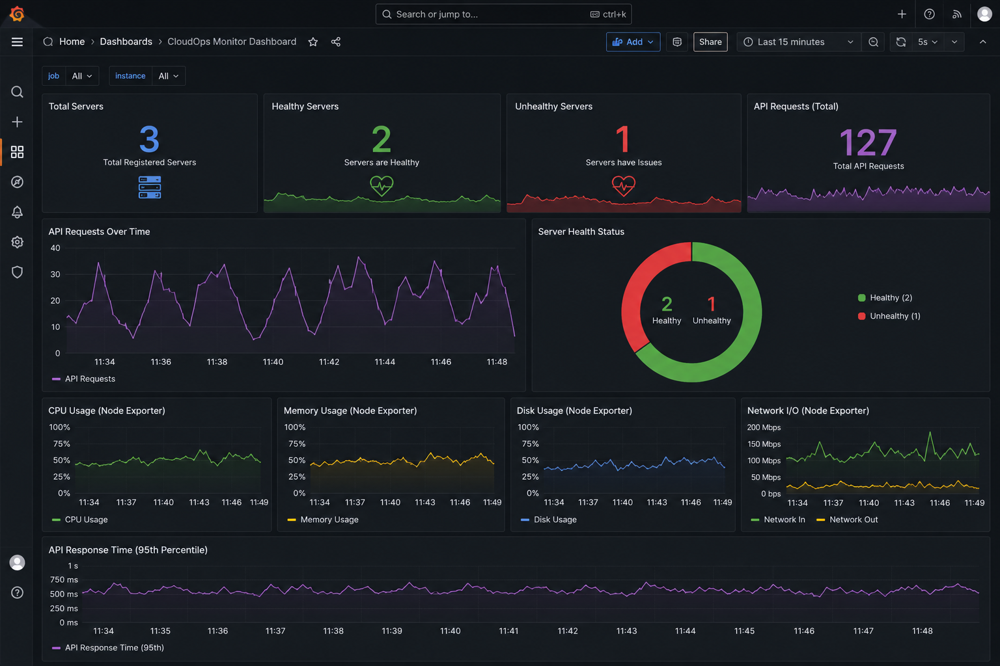
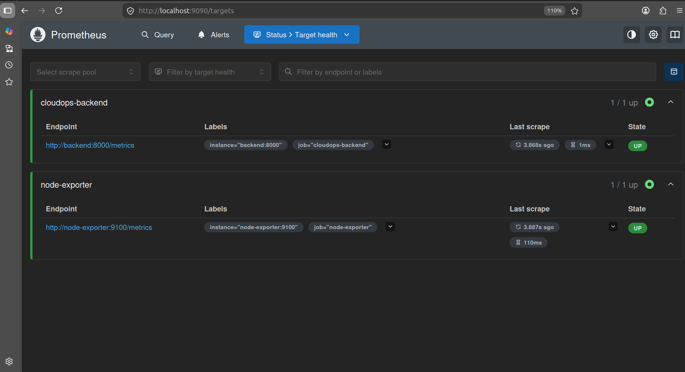
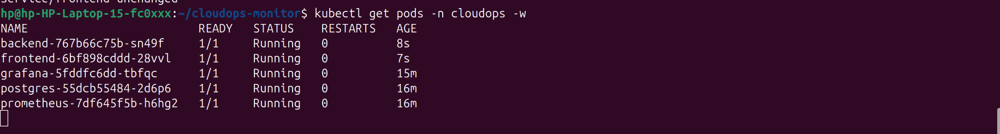
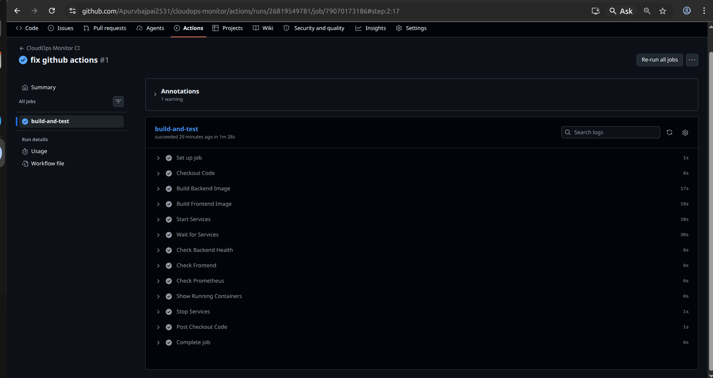

# 🚀 CloudOps Monitor

CloudOps Monitor is a cloud-native infrastructure and application monitoring platform built to demonstrate real-world DevOps practices. The project integrates FastAPI, Streamlit, PostgreSQL, Docker, Kubernetes, Prometheus, Grafana, OpenTelemetry, Node Exporter, and GitHub Actions to provide server inventory management, monitoring, observability, and CI/CD automation.

---

# 📌 Features

* Server Inventory Management
* Real-Time Server Health Monitoring
* API Metrics Collection
* Infrastructure Monitoring with Node Exporter
* Grafana Dashboard Visualization
* Prometheus Metrics Scraping
* OpenTelemetry Tracing
* Docker Containerization
* Kubernetes Deployment
* GitHub Actions CI/CD Pipeline

---

# 🏗️ Architecture



The architecture consists of:

* Streamlit Frontend
* FastAPI Backend
* PostgreSQL Database
* Prometheus Monitoring Stack
* Grafana Visualization Layer
* OpenTelemetry Collector
* Node Exporter
* Docker & Kubernetes
* GitHub Actions CI/CD

---

# 📐 System Design



### Request Flow

1. User accesses the Streamlit dashboard.
2. Frontend sends requests to FastAPI backend.
3. Backend stores and retrieves data from PostgreSQL.
4. Backend exposes metrics through `/metrics`.
5. Prometheus scrapes application metrics.
6. Node Exporter provides infrastructure metrics.
7. Grafana visualizes metrics through dashboards.
8. OpenTelemetry collects traces and observability data.
9. GitHub Actions automates build and deployment workflows.
10. Kubernetes orchestrates containers and services.

---

# 🛠️ Tech Stack

| Category               | Technology     |
| ---------------------- | -------------- |
| Frontend               | Streamlit      |
| Backend                | FastAPI        |
| Database               | PostgreSQL     |
| Containerization       | Docker         |
| Orchestration          | Kubernetes     |
| Monitoring             | Prometheus     |
| Visualization          | Grafana        |
| Infrastructure Metrics | Node Exporter  |
| Observability          | OpenTelemetry  |
| CI/CD                  | GitHub Actions |
| Scripting              | Bash           |

---

# 📊 Dashboard Screenshots

## Frontend Dashboard



---

## Backend Monitoring



---

## Grafana Dashboard



---

## Prometheus Dashboard



---

# ☸️ Kubernetes Deployment



### Deploy Application

```bash
kubectl apply -f k8s/
```

### Verify Pods

```bash
kubectl get pods -n cloudops
```

### Verify Services

```bash
kubectl get svc -n cloudops
```

---

# 🔄 CI/CD Pipeline



### Workflow

```text
Developer Push
      │
      ▼
GitHub Repository
      │
      ▼
GitHub Actions
      │
      ▼
Docker Image Build
      │
      ▼
Kubernetes Deployment
      │
      ▼
Monitoring & Observability Stack
```

---

# 📂 Project Structure

```text
cloudops-monitor/
├── backend/
├── frontend/
├── k8s/
├── monitoring/
├── otel/
├── screenshots/
├── .github/workflows/
├── docker-compose.yml
├── start.sh
└── README.md
```

---

# 🚀 Monitoring Stack

### Prometheus

* Application Metrics Collection
* Infrastructure Metrics Scraping
* Service Discovery

### Grafana

* Dashboard Visualization
* Real-Time Monitoring
* Performance Analytics

### Node Exporter

* CPU Monitoring
* Memory Monitoring
* Disk Monitoring
* Network Monitoring

### OpenTelemetry

* Distributed Tracing
* Application Observability
* Performance Insights

---

# 🎯 Future Enhancements

* Helm Charts
* Terraform Infrastructure Provisioning
* AWS EKS Deployment
* Alertmanager Integration
* ArgoCD GitOps Deployment
* Multi-Node Kubernetes Cluster

---

# 👨‍💻 Author

**Apurv Bajpai**

Backend Developer | Aspiring DevOps Engineer

* GitHub: https://github.com/Apurvbajpai2531
* LinkedIn: [www.linkedin.com/in/apurv-bajpai-91b71227a](http://www.linkedin.com/in/apurv-bajpai-91b71227a)

---

⭐ If you found this project useful, consider giving it a star.
